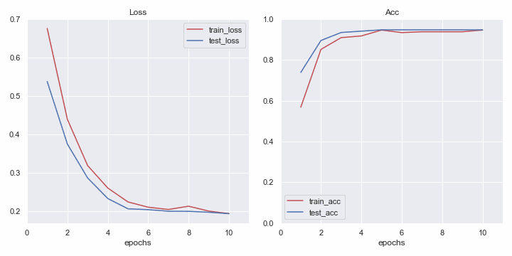
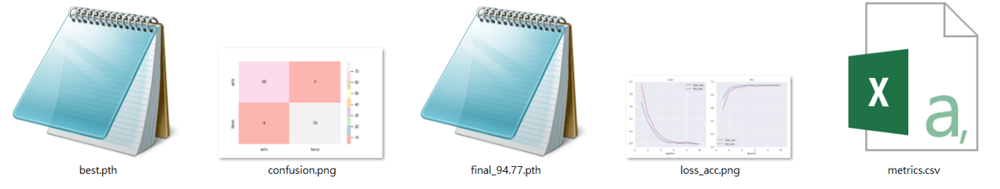

# AI-utils
這是Yuyi正在整理的自己寫過的AI工具，Yuyi是誰!?!?，就是我啦XD，目前先放上分類，以後可能會陸陸續續增加其他的功能，組成一個有更多功能的package。

## 分類
### 範例
以下我將藉由 Kaggle的 Ants&Bees 數據集來講解怎麼使用我的 package : <br>
[數據集下載 : <a href="https://www.kaggle.com/datasets/gauravduttakiit/ants-bees" target="__blank">Ants&Bees Datasets</a>]

*  **將下載並解壓縮好的數據集放在 ```AI-utils/``` 資料夾內**
* **執行 ```train_classifier.py```**，在執行的過程中，會同步顯示 Loss、Acc圖 (如下)


* **執行完畢會生成 ```AI-utils/metrics/Result_1/``` 資料夾，裡面會存放 : <u>模型權重</u>、<u>最終Loss_Acc圖</u>、<u>Confusion Matrix圖</u> 以及 一份<u>excel檔案(內含每個類別的acc、recall、fi-score)</u>**


